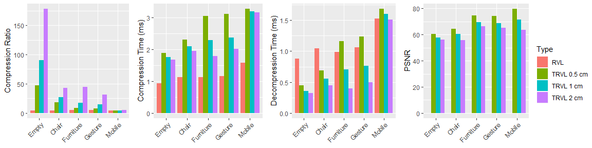

# Temporal RVL

This repository provides a header-only implementation of Temporal RVL (cpp/src/rvl.h, cpp/src/trvl.h) with code and data for the replication of the manuscript at below. To see how to use the header files, see example.cpp, especially function run_trvl().

For replication (currently, this repository has been tested only on Windows with Visual Studio),
  1. Unzip data from https://drive.google.com/open?id=1r1OzFwxAsiOSXbqZhRjX6s_4F2TDfnr3 into folder data.
  2. Install OpenCV using vcpkg inside this repository as a submodule.
  3. Build cpp with CMake.
  4. Run Paper (paper.cpp) that will produce a csv file in folder output.
  5. Open folder r-studio/temporal-rvl.Rproj with RStudio.

For usage,
  1. Download rvl.h and trvl.h in cpp/src.
  2. Use them in your project.

## Citation
Jun, H., & Bailenson, J. (2020). Temporal RVL: A Depth Stream Compression Method. Proceedings of IEEE Conference on Virtual Reality and 3D User Interfaces Abstracts and Workshops (VRW). 
